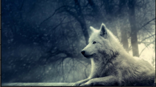
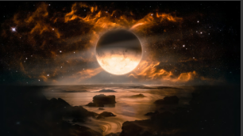
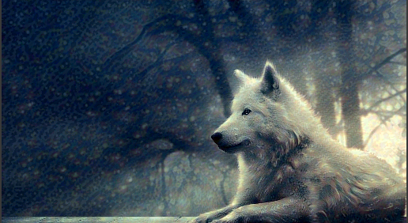
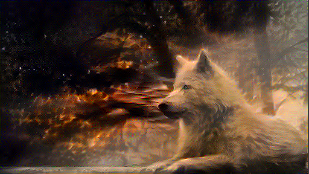

## Neural Style Transfer
A tensorflow implementation of the project has been described in paper :
[A neural Algorithm of Artistic Style](https://arxiv.org/pdf/1508.06576v2.pdf) 
The implementation process is as follows:
* The content and style image are run through the vgg model (extractor) to get the target content and style.
* An image is generated closer to the content image (or with noise added) - Generated Image
* Loss of the generated image is computed
* Tensorflow graph is intilaised and the generated image
### Requirements
#### Data Files
Download the pretrained model from the following link : [imagenet-vgg-verydeep-19.mat](http://www.vlfeat.org/matconvnet/models/imagenet-vgg-verydeep-19.mat). Save it in a directory pre_trained_model
The above method is used in the old-approach file. (which has some bugs at present). 

The data can also be loaded and used directly from keras applications.
#### Dependencies
You can install the dependencies using `pip install -r requirements.txt`. Here's the list of required packages
 for manual installation
* Tensorflow
* Numpy
* pandas
* Scipy
### Sample Results :
Content and Style Images 
   
Generated Images 
 
 
### References :
The implementation has had  from the following projects
* A tutorial version of the implementation
  https://github.com/Hvass-Labs/TensorFlow-Tutorials/blob/master/15_Style_Transfer.ipynb
* Implementation related to style transfer while preserving color and vedio style transfer
  https://github.com/cysmith/neural-style-tf
* Fun implementation
  https://github.com/hwalsuklee/tensorflow-style-transfer
